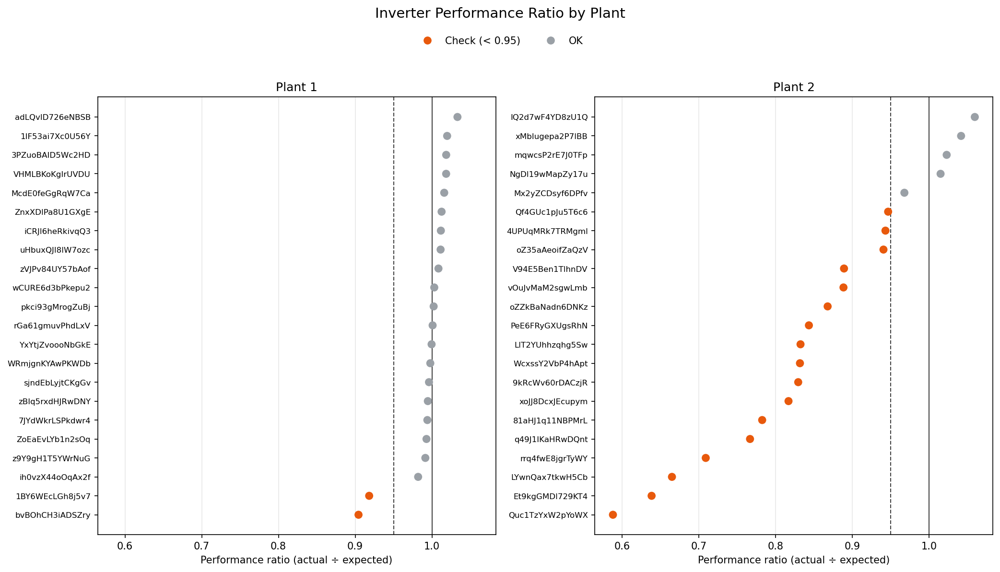

# ⚡ Renewable Energy Forecasting & Asset Health Check

A machine learning project on real solar and wind data, built around two questions an energy operator asks every day:

1. **Wind — Forecasting:** *How much power will the turbine produce in the next hour?*
2. **Solar — Health Check:** *Are all the inverters producing what they should, and if not, how much energy are we losing?*

Each dataset is used for what it is best suited to. The wind dataset has a full year of history, which makes it right for time-series forecasting and deep learning. The solar dataset has ~22 inverters working under the same weather, which makes it right for spotting underperforming equipment.

> **Status: 🔄 In Progress** — Wind forecasting and solar health check complete. Streamlit dashboard next.

---

## 🧭 Project at a Glance

| | 💨 Wind | ☀️ Solar |
|---|---|---|
| **Question** | How much power will we produce next? | Which inverters are underperforming, and what does it cost? |
| **Task** | Time-series forecasting | Underperformance (anomaly) detection |
| **Models** | Naive baseline → XGBoost → LSTM | Expected-output regression → residual analysis |
| **Output** | Next-hour power forecast + model comparison | Inverter ranking + lost energy (kWh) + estimated cost (₹) |
| **Why this dataset** | Full year of 10-min data (~50K rows): enough history for forecasting and for training an LSTM | ~22 inverters under identical weather: weak inverters stand out against their neighbours |

---

## 💨 Part 1 — Wind Power Forecasting

### What we are doing
Forecasting the turbine's power output for the **next hour**, using only information available at the time of prediction.

- **Features:** past power output (lags), past wind speed, wind direction, rolling averages, and time features (hour, day, month)
- **Models, from simplest to most complex:**
  1. **Naive baseline** — "next hour will look like the last hour." Every model must beat this to be useful.
  2. **XGBoost** — a tree-based model trained on lag and time features.
  3. **LSTM (PyTorch)** — a deep learning model that learns directly from sequences of past observations.
- **Evaluation:** time-based train/test split (train on earlier months, test on later months), compared using MAE and RMSE.

### Why
- **Naive baseline first:** a forecast only has value if it beats the simplest possible guess.
- **XGBoost vs. LSTM:** tests whether a deep learning model's extra complexity actually pays off over a strong tree-based model on this data. Whichever wins, the comparison is the result.
- **Time-based split:** this is time-series data. A random split would let the model see the future during training and overstate its accuracy.

### What we are not doing, and why
- **No weather forecast inputs:** real forecasting systems use predicted wind speed, but historical forecasts for this turbine's location and dates aren't available. The model forecasts from past observations only.
- **No long-range forecasting:** accuracy from past observations alone drops quickly beyond short horizons, so the focus stays on the next hour.

---

## ☀️ Part 2 — Solar Asset Health Check

### What we are doing
Finding inverters that produce less than they should, and estimating what that shortfall costs.

1. **Learn expected output:** a regression model predicts how much AC power an inverter *should* produce from irradiation, ambient temperature, module temperature, and time of day.
2. **Compare expected vs. actual:** the gap between the two (the residual) is the signal. A small gap means normal operation; a large, persistent shortfall points to a possible fault, dirty panels, or downtime.
3. **Rank and quantify:** rank inverters by how consistently they underproduce compared with others under identical weather, and convert the shortfall into **lost energy (kWh)** and **estimated cost (₹)** using a stated tariff assumption.

### Why
- **Same weather, many inverters:** all inverters in a plant share one weather sensor, so an inverter that keeps lagging behind its neighbours is a strong, fair signal of a problem.
- **Residual-based detection:** simple, explainable, and widely used in industrial monitoring. Every flag traces back to "the model expected X, the inverter produced Y".
- **Ending at a cost figure:** turns a model output into a maintenance decision: *which inverter to check first*.

### What we are not doing, and why
- **No solar forecasting:** the solar dataset covers only ~34 days. That's too short to forecast reliably or to train an LSTM without overfitting, so the data is used where it's strongest: comparing inverters.

---
## 🏁 Wind Forecasting Results

1-hour-ahead forecasts on the test period (Nov–Dec 2018), with all models scored on the same rows:

| Model | MAE (kW) | RMSE (kW) | Skill vs. naive |
|---|---|---|---|
| Naive (persistence) | 285.9 | 494.1 | 0.000 |
| **XGBoost (predicts change) ✅ selected** | 311.9 | **477.6** | **0.033** |
| LSTM (predicts change) | 314.7 | 479.5 | 0.030 |

- **Reframing the target mattered more than the model:** predicting the *change* in power instead of its level more than doubled XGBoost's skill (0.013 → 0.034 in notebook 04).
- **XGBoost and LSTM are essentially tied**, both reducing RMSE by about 3% compared with persistence. XGBoost is selected because it is marginally better, faster, and more interpretable.
- **A bigger model didn't help:** the LSTM overfit after one epoch, and a smaller variant didn't generalise better.
- **Conclusion:** from past observations alone, persistence is close to the ceiling one hour ahead. Larger gains would require weather-forecast inputs.

---
## ☀️ Solar Health Check Results



| Plant | Inverters flagged | Daylight readings offline | Model R² (vs. peer median) |
|---|---|---|---|
| Plant 1 | 2 of 22 | 0.2% | 0.99 |
| Plant 2 | **17 of 22** | **11.9%** | 0.79 |

- **Plant 1 is healthy:** only 2 inverters fall below the 0.95 performance-ratio threshold (≈ 0.91–0.92).
- **Plant 2 has a plant-wide problem:** most inverters show repeated zero-output periods in good sunlight (the worst: 50–80 hours in 34 days), roughly 60× more often than Plant 1. That points to a shared, plant-level cause, so the recommendation is to investigate the plant as a whole first.
- **Estimated impact:** ~790,000 kWh lost over 34 days, about **₹23.7 lakh** (≈ **₹2.5 crore/year** if unaddressed), assuming a ₹3/kWh tariff. Figures are indicative.
- **Validated two ways:** the model-based ranking matches a model-free peer comparison (Spearman ρ = 0.971). A diagnostic showed Plant 2's low R² against individual inverters (0.17) was driven by outages, not model error (0.79 against the peer median).

---
## 📈 Key Findings So Far (EDA)

- **Wind:** clean data with no missing values. Output is noisy with no daily pattern. Wind speed vs. power follows the expected S-shaped curve: near zero at low speeds, a steep rise, then a flat plateau at rated capacity. A few small negative power values appear, consistent with the turbine drawing grid power while idling; these are handled during preprocessing.
- **Solar:** clean data with no missing values. Output follows a clear daily cycle: zero at night, peaking around midday.

---

## ⚠️ Known Limitations

- **Forecasts use past observations only** (no weather forecasts), so they set a realistic baseline rather than production-grade accuracy.
- **Short solar history (~34 days)** limits the health check to that period and rules out seasonal analysis.
- **Different locations:** the wind (Turkey) and solar (India) datasets are analysed independently, not combined.
- **Cost estimates** depend on an assumed electricity tariff and are indicative, not exact.

---

## 📊 Datasets

| Part | Dataset | Details |
|---|---|---|
| Wind | [Wind Turbine SCADA Dataset](https://www.kaggle.com/datasets/berkerisen/wind-turbine-scada-dataset) (Kaggle) | 1 turbine in Turkey, full year 2018, 10-min intervals. Active power, wind speed, wind direction, theoretical power curve |
| Solar | [Solar Power Generation Data](https://www.kaggle.com/datasets/anikannal/solar-power-generation-data) (Kaggle) | 2 plants in India, ~34 days, 15-min intervals. Inverter-level generation + plant-level weather sensor data |

*Raw data is not committed to this repo (see `.gitignore`). Download it from the links above into `data/raw/wind/` and `data/raw/solar/`.*

---

## 🗂️ Repository Structure

```
renewable-energy-forecasting/
├── data/
│   ├── raw/
│   │   ├── solar/        # Plant 1 & 2 generation + weather CSVs (not committed)
│   │   └── wind/         # Turbine SCADA CSV (not committed)
│   └── processed/        # Cleaned / feature-engineered data
├── notebooks/
│   ├── 01_solar_eda.ipynb
│   └── 02_wind_eda.ipynb
├── solar/                # Solar health-check pipeline
├── wind/                 # Wind forecasting pipeline
├── utils/                # Shared preprocessing, evaluation, plotting
├── models/               # Saved trained models
├── images/               # Plots used in this README
├── requirements.txt
└── README.md
```

---

## 🛠️ Tech Stack

- **Python** · pandas · NumPy · scikit-learn · XGBoost
- **Deep learning:** PyTorch (LSTM)
- **Visualization:** matplotlib, seaborn
- **Explainability:** SHAP
- **Deployment:** Streamlit

---

## 🗓️ Roadmap

| Phase | Status |
|---|---|
| Project scoping & repo setup | ✅ Done |
| Data collection & EDA (wind + solar) | ✅ Done |
| Wind: feature engineering (lags, rolling, time features) | ✅ Done |
| Wind: naive baseline + XGBoost forecasting | ✅ Done |
| Wind: LSTM forecasting + comparison with XGBoost | ✅ Done |
| Solar: expected-output model + inverter ranking | ✅ Done |
| Solar: lost energy & cost estimation | ✅ Done |
| Streamlit dashboard (Wind Forecast tab + Solar Health tab) | 🔄 In progress |
| **(Stretch)** Wind: day-ahead forecasting | ⏳ Planned |
| **(Stretch)** Wind: energy loss vs. theoretical power curve | ⏳ Planned |
| **(Stretch)** Prediction intervals via quantile regression | ⏳ Planned |
---

## 👤 About

Built by **Trisha Haldar** as a portfolio project during an AI/ML certificate program (IIT Patna × Masai School).

*This README is updated as the project progresses.*