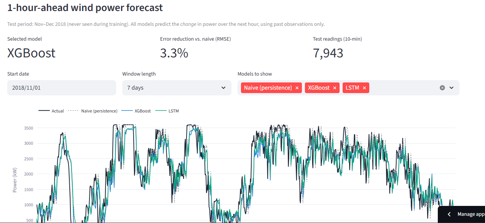

# ⚡ Renewable Energy Forecasting & Asset Health Check

**[🔴 Live dashboard] (https://trisha-renewable-energy.streamlit.app/)** · Python · XGBoost · PyTorch · Streamlit

A machine learning project on real solar and wind data, built around two questions an energy operator asks every day:

1. **Wind — Forecasting:** *How much power will the turbine produce in the next hour?*
2. **Solar — Health Check:** *Are all the inverters producing what they should, and if not, how much energy are we losing?*

Each dataset is used for what it suits best: the wind data has a full year of history (enough for forecasting and deep learning), and the solar data has ~22 inverters per plant sharing the same weather (good for spotting underperforming equipment).

---

## 🖥️ Live Dashboard



**[Open the dashboard](https://trisha-renewable-energy.streamlit.app/)**. It has three tabs:

| Tab | What it does |
|---|---|
| 💨 **Wind Forecast** | Compare naive, XGBoost, and LSTM forecasts against actual output for any window of the test period |
| 🔴 **Live Replay** | Simulated real-time forecasting: pick a moment, and the app builds features from **only the readings up to that moment** and runs the trained XGBoost model on demand. Step through time and reveal what actually happened |
| ☀️ **Solar Health Check** | Inverter performance ranking, estimated losses with an adjustable tariff, and daily actual vs. expected output for any inverter |

---

## 🧭 Project at a Glance

| | 💨 Wind | ☀️ Solar |
|---|---|---|
| **Question** | How much power will we produce in the next hour? | Which inverters are underperforming, and what does it cost? |
| **Task** | Time-series forecasting | Underperformance (anomaly) detection |
| **Models** | Naive baseline → XGBoost → LSTM (PyTorch) | Expected-output regression (XGBoost) → residual analysis |
| **Result** | XGBoost selected: 3.3% lower RMSE than persistence | 19 of 44 inverters flagged; ~₹23.7 lakh estimated loss in 34 days |

---

## 💨 Part 1 — Wind Power Forecasting

**Goal:** forecast turbine output **1 hour ahead** using only information available at prediction time.

**Approach**
- **Features:** past power and wind speed (lags up to 24 h), rolling averages and volatility, trend features, and cyclical encodings of wind direction, hour, and month
- **Data handling:** 2,030 missing timestamps (~4% of the year). Gaps up to 1 hour were interpolated; longer gaps were left unfilled rather than invented. 57 small negative power readings (turbine drawing grid power while idle) were clipped to 0
- **Time-based split:** train Jan–Aug, validate Sep–Oct, test Nov–Dec, so no future data leaks into training
- **Model selection on the validation set only**; the test set was used once, to report results

**Results** (test period Nov–Dec 2018, all models scored on the same 7,943 rows)

| Model | MAE (kW) | RMSE (kW) | Skill vs. naive |
|---|---|---|---|
| Naive (persistence) | 285.9 | 494.1 | 0.000 |
| **XGBoost (predicts change) ✅ selected** | 311.9 | **477.6** | **0.033** |
| LSTM (predicts change) | 314.7 | 479.5 | 0.030 |

**Key findings**
- **Persistence is a strong baseline** one hour ahead: wind rarely changes drastically within an hour.
- **Reframing the target mattered more than the model.** The first XGBoost (predicting power directly) barely beat persistence. Predicting the *change* in power instead more than doubled its skill (0.013 → 0.034).
- **XGBoost and LSTM are essentially tied.** XGBoost is selected: marginally better, trains in seconds, easier to interpret.
- **A bigger model didn't help.** The LSTM overfit after one epoch, and a smaller, regularised variant did worse on validation. The limit is the information in the data, not model capacity: larger gains would need weather-forecast inputs.

---

## ☀️ Part 2 — Solar Asset Health Check

**Goal:** find inverters that produce less than they should, and estimate the energy and money lost.

**Approach**
1. A model per plant learns what a **typical** inverter produces from irradiation, temperatures, and time of day
2. Each inverter's actual output is compared with that expectation: **performance ratio = actual ÷ expected energy**; below 0.95 is flagged
3. Shortfalls are converted into lost kWh and ₹ (tariff assumption: ₹3/kWh)

**Two design decisions:**
- **The inverter ID is deliberately not a feature.** Otherwise the model would learn that a weak inverter is "supposed" to be weak, and the problem would vanish from the residuals.
- **The model predicts the median inverter** (absolute-error objective), so faulty inverters don't drag down "expected" output for everyone.


**Results**

| Plant | Inverters flagged | Daylight readings offline | Model R² (vs. peer median) |
|---|---|---|---|
| Plant 1 | 2 of 22 | 0.2% | 0.99 |
| Plant 2 | **17 of 22** | **11.9%** | 0.79 |

**Key findings**
- **Plant 1 is healthy:** only 2 inverters fall below the threshold (≈ 0.91–0.92).
- **Plant 2 has a plant-wide problem:** most inverters show repeated zero-output periods in good sunlight (the worst: 50–80 hours in 34 days), roughly 60× more often than Plant 1. That points to a shared, plant-level cause, so the recommendation is to investigate the plant as a whole first.
- **Estimated impact:** ~790,000 kWh lost over 34 days, about **₹23.7 lakh** (≈ **₹2.5 crore/year** if unaddressed). Figures are indicative.
- **Validated two ways:** the model-based ranking matches a model-free comparison with each plant's median inverter (**Spearman ρ = 0.971**). Plant 2's low R² against individual inverters (0.17) was diagnosed as outage-driven: against the peer median it rises to 0.79.

---

## ✅ Engineering & Validation

- **No data leakage:** time-based splits throughout; features use only past and present readings; scalers fitted on training data only
- **Gap-aware sequences:** the LSTM only uses 6-hour windows with no missing timestamps, so sequences never silently join data across gaps
- **Fair comparison:** all wind models are evaluated on identical test rows
- **Deployment parity check:** the dashboard's feature pipeline (`dashboard/wind_pipeline.py`) was verified to reproduce the training features for all 8,085 test rows (max difference 2.5 × 10⁻⁸) and the saved forecasts exactly (max difference 0.000000 kW). The deployed model gets exactly the inputs it was trained on

---

## ⚠️ Limitations

- **No weather-forecast inputs:** wind forecasts use past observations only. Historical weather forecasts for this turbine's location and dates aren't available
- **Short solar history (34 days):** too short for solar forecasting or seasonal analysis, which is why the solar data is used for the health check instead
- **Zero-output periods:** from data alone, a real outage can't be distinguished from a logger recording 0
- **Cost estimates** depend on the tariff assumption; the annualised figure assumes the same weather and faults all year
- **Different locations:** the wind (Turkey) and solar (India) datasets are analysed independently
- **Live Replay** replays recorded 2018 data; with a live data feed, the same pipeline would run in real time

---

## 📊 Datasets

| Part | Dataset | Details |
|---|---|---|
| Wind | [Wind Turbine SCADA Dataset](https://www.kaggle.com/datasets/berkerisen/wind-turbine-scada-dataset) (Kaggle) | 1 turbine in Turkey, full year 2018, 10-min intervals |
| Solar | [Solar Power Generation Data](https://www.kaggle.com/datasets/anikannal/solar-power-generation-data) (Kaggle) | 2 plants in India, 15 May–17 June 2020, 15-min intervals, ~22 inverters per plant |

---

## 🗂️ Repository Structure

```
renewable-energy-forecasting/
├── .streamlit/config.toml           # Dashboard theme
├── dashboard/
│   ├── app.py                       # Streamlit dashboard (3 tabs)
│   ├── wind_pipeline.py             # Raw readings → model features (used by Live Replay)
│   └── requirements.txt             # Dashboard-only dependencies (used for deployment)
├── data/
│   ├── raw/                         # Kaggle CSVs (not committed — see Datasets)
│   └── processed/                   # Engineered data; small files used by the dashboard are committed
├── images/                          # Figures used in this README
├── models/                          # Trained models; XGBoost files used by the dashboard are committed
├── notebooks/
│   ├── 01_solar_eda.ipynb
│   ├── 02_wind_eda.ipynb
│   ├── 03_wind_feature_engineering.ipynb
│   ├── 04_wind_forecasting_xgboost.ipynb
│   ├── 05_wind_forecasting_lstm.ipynb
│   ├── 06_solar_health_check.ipynb
│   └── 07_wind_replay_pipeline.ipynb
├── requirements.txt                 # Full project dependencies
└── README.md
```

---

## ▶️ Run Locally

```bash
git clone https://github.com/trishhal26/renewable-energy-forecasting.git
cd renewable-energy-forecasting
pip install -r requirements.txt

# The dashboard runs straight away (the files it needs are committed):
python -m streamlit run dashboard/app.py
```

To reproduce the analysis, download both datasets from Kaggle into `data/raw/solar/` and `data/raw/wind/`, then run the notebooks in order (01 → 07).

---

## 🛠️ Tech Stack

- **Data & ML:** Python, pandas, NumPy, scikit-learn, XGBoost
- **Deep learning:** PyTorch (LSTM)
- **Visualisation:** matplotlib, seaborn, Plotly
- **Deployment:** Streamlit, Streamlit Community Cloud

---

## 🔭 Future Work

- **Prediction intervals** (quantile regression), e.g. "expect 1,800–2,400 kW in the next hour"
- **Wind energy loss vs. the manufacturer's power curve**, extending the health check to the turbine
- **Weather-forecast inputs**, using a turbine dataset with a known location and historical forecasts
- **Day-ahead forecasting**

---

## 👤 About

Built by **Trisha Haldar** as a portfolio project during an AI/ML certificate program (IIT Patna × Masai School).